# Excercise 1

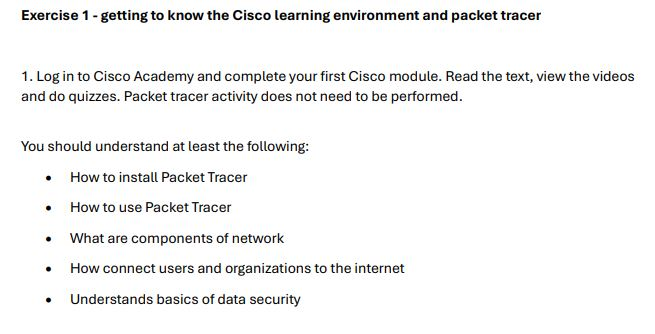

---

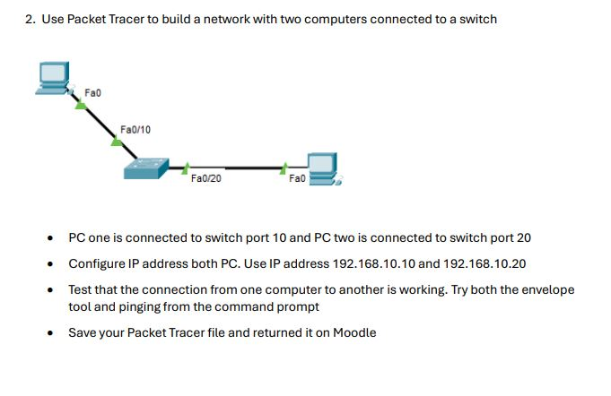

1. Under Options => Preferences, select "Always Show Port Labels and Logical Workspace"

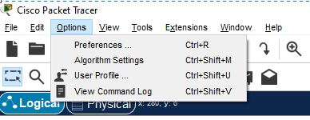
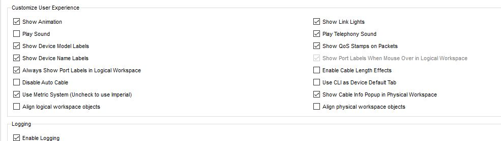

2. Select PC from "End Devices" => "End Devices" and place them in the logical view (Repeat)

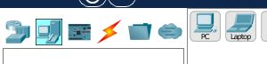
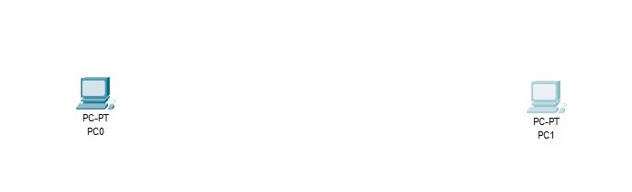

3. Select Switch from "Network Devices" => "Switches" => "2956" and place them in the logical view

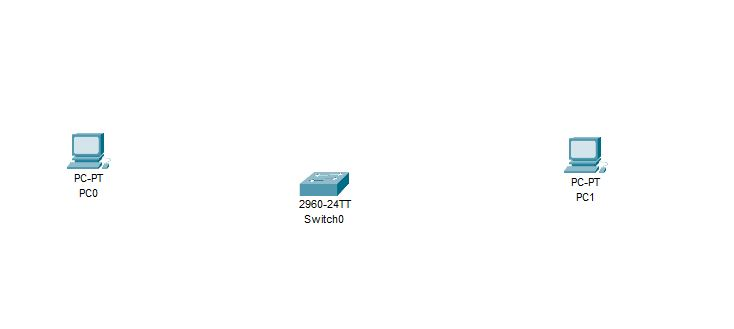

4. Connect them using "Connections" => "Copper Straight-Through" cable.
   - Fast Ethernet 0(PC0) to Fast Ethernet 10(Switch)
   - Fast Ethernet 0(PC1) to Fast Ethernet 20(Switch)

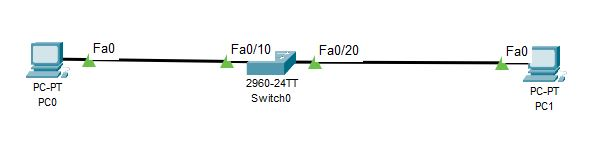

5. Click PC0 and go to "Desktop" tab and select "IP Configuration" and set IPv4 : "192.168.10.10" and press tab then Subnet Mask will auto update.

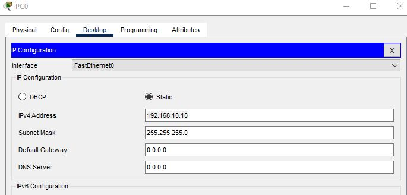

6. Click PC1 and go to "Desktop" tab and select "IP Configuration" and set IPv4 : "192.168.10.20" and press tab then Subnet Mask will auto update.

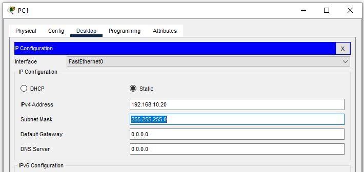

7.  Click PC0 and go to "Desktop" tab and select "Command Prompt". Then type,

    - ping 192.168.10.10
    - ping 192.168.10.20

8.  If you get a reply for both commands, then the connection is success.

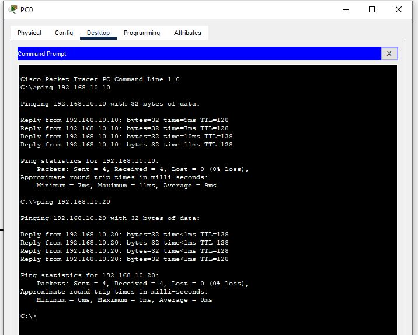

9. Open PC1 and repeat the same task, If the response is success. connection is success.

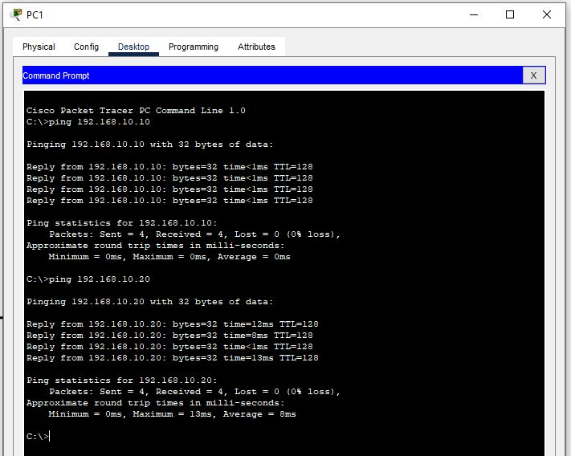

10. To use envelope method, select the PDU icon from the top, (Simple PDU - closed envelope)

11. Then select the PC0 and PC1 (Which mean Msg should go from PC0 to PC1). Then it will display below success msg if the connection is success.

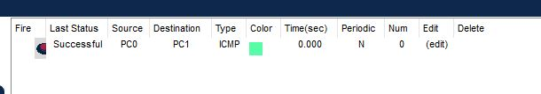

12. Go to Simulation pane and play it to see the simulation results,

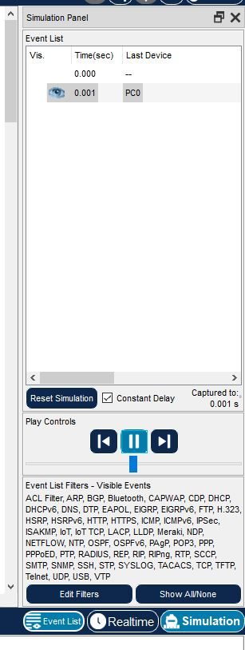
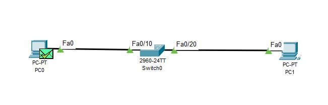
