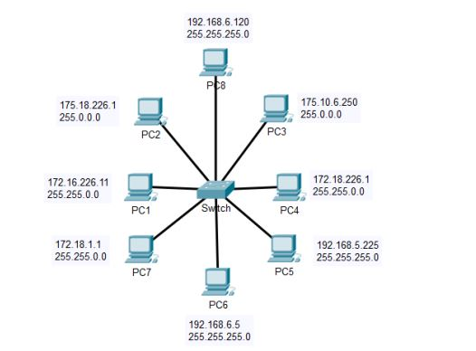
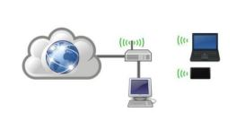
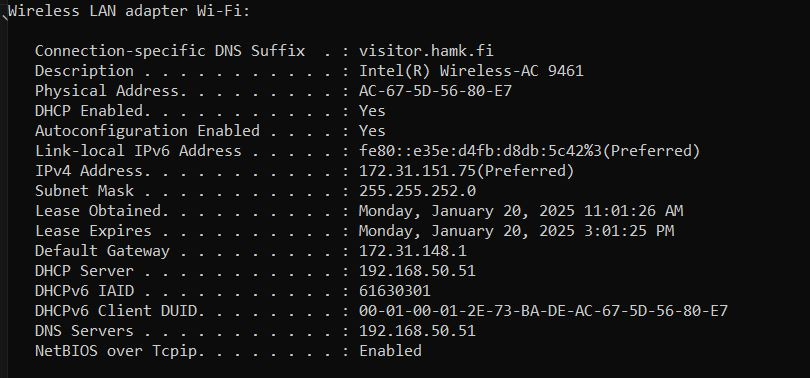

# Excercise 2

### IP ADDRESS EXERCISES

1. The IP addresses of devices and their subnet masks are shown below. Find out which part of
   the address is network and which part is host.

   - a) 192.168.6.25, 255.255.0.0
   - b) 170.10.0.15, 255.255.255.0
   - c) 10.10.10.1, 255.255.255.0

| #   | Network      | Host |
| --- | ------------ | ---- |
| a   | 192.168.     | 6.25 |
| a   | 255.255.     | 0.0  |
| --- | ----------   | ---- |
| b   | 170.10.0.    | 15   |
| b   | 255.255.255. | 0    |
| --- | ----------   | ---- |
| c   | 10.10.10.    | 1    |
| c   | 255.255.255. | 0    |
| --- | ----------   | ---- |

2. Which of the computers in the network below can operate with each other?
   

   - PC1 => Network part => 172.16 (No communications)
   - PC2 => Network part => 175 => PC3
   - PC3 => Network part => 175 => PC2
   - PC4 => Network part => 172.18 => PC7
   - PC5 => Network part => 192.168.5 (No communications)
   - PC6 => Network part => 192.168.6 => PC8
   - PC7 => Network part => 172.18 => PC4
   - PC8 => Network part => 192.168.6 => PC6

3. The computer, "laptop" and mobile device in the picture are connected to the Internet via the router in the picture. The router's IP address is 172.18.226.1 and the subnet mask is 255.255.255.0.

   

- a) What should the IP addresses and masks of terminal devices be like in order for Internet access to be possible?

- Network part of the address is "172.18.226"
- Network address "172.18.226.0"
- The possible range of the IP is 172.18.226.2 to 172.18.226.224
- Network broadcast address is 172.18.226.225
- Subnet mask should be 255.255.255.0

# PC

- IP => 172.18.226.2
- Subnet Mask => 255.255.255.0

# Mobile

- IP => 172.18.226.3
- Subnet Mask => 255.255.255.0

# Laptop

- IP => 172.18.226.4
- Subnet Mask => 255.255.255.0

- b) What kind of IP address should be defined as the default gateway for terminal devices

- Default gateway is 172.18.226.1 (The IP of the router)

4. What is the first and last address available for devices on the networks below. Why?

- a) 192.0.0.0 ; 255.255.255.0

  - Network address - 192.0.0.0
  - Broadcast address - 192.0.0.255
  - Available IP range 192.0.0.1 to 192.0.0.254

- b) 172.0.0.0 ; 255.255.0.0

  - Network address - 172.0.0.0
  - Broadcast address - 172.0.255.255
  - Available IP range 172.0.0.1 to 172.0.255.254

- c) 112.0.0.0 ; 255.0.0.0

  - Network address - 112.0.0.0
  - Broadcast address - 112.255.255.255
  - Available IP range 112.0.0.1 to 112.255.255.254

- d) 192.168.0.0 ; 255.255.0.0

  - Network address - 192.168.0.0
  - Broadcast address - 192.168.255.255
  - Available IP range 192.168.0.1 to 192.168.255.254

  - As always we have to give the first address as the network address and the last address as the broadcast address the range inbetween can use for the IP assignments.

5. Find out from your own computer:

- Use command _ipconfig /all_

- a) Your IP address => 172.31.151.75
- b) Gateway IP address => 172.31.148.1
- c) DNS server IP address => 255.255.252.0
- d) DHCP server IP address => 192.168.50.51
- e) Does your computer use a public or private IP address => since the IP is 172.31.151.75 it is using a private IP address.
