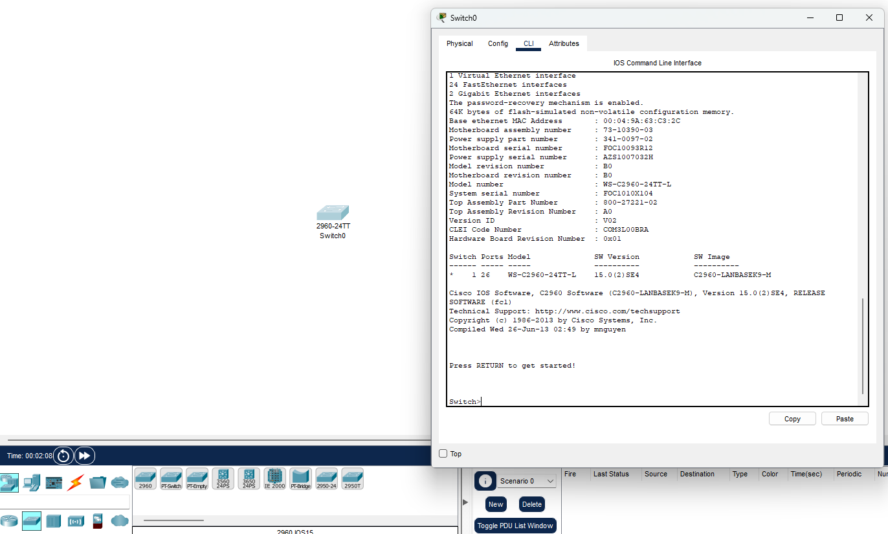
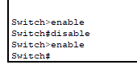

# Excercise 3

---

# GETTING TO KNOW THE CISCO-IOS INTERFACE

## OBJECTIVES

### The aim of the work is to familiarize yourself with the Cisco user interface (IOS) and the basic configuration of the switch using the Packet Tracer program.

#### 1. In Packet Tracer, choose the Cisco 2960 switch, select the CLI tab, and learn how the user interface works.

1. Open Packet Tracer and select Network Devices => Switches => 2960

2. Select the network switch and go to CLI tab then press Enter,

#### 2. Familiarize yourself with the switch interface by figuring out the meaning of the following commands. (Note that you can always type a question mark, e.g. show?, after a command, so that the command is not executed, but you can see what kind of additional commands can be entered.)

    - • Find out how to navigate the different command modes of the router (user, priviledge, global configuration and specific configuration)
    - • Try shortening commands e.g. ena instead of enable, etc.
    - • Try completing commands with the tab key

**User mode** : User mode can be identify by the **>** symbole and when you first enter to the CLI mode you are in the user mode. You can switch between **User mode** and **Exe priviledge mode** by using commands **enable** and **disable**.

**Exe priviledge mode** : The **Exe priviledge mode** can be identified by the **#** symbole.

