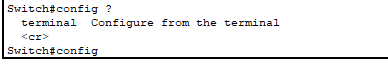
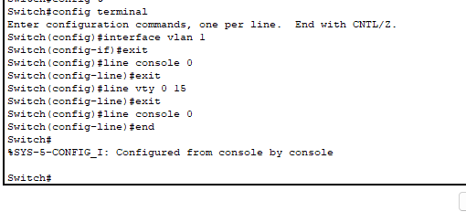
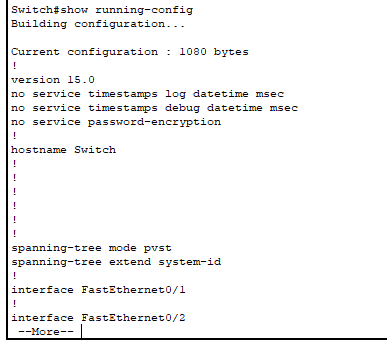
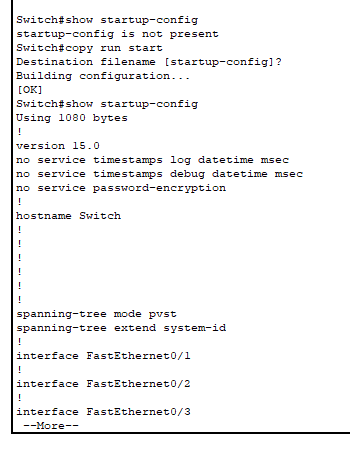
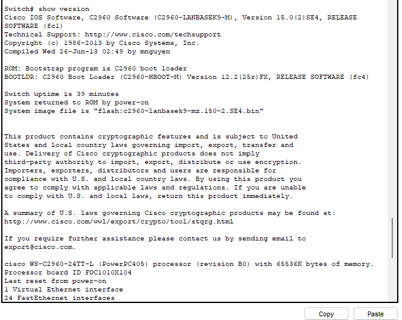
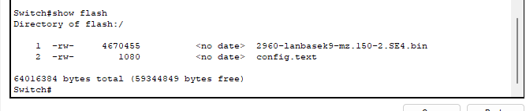
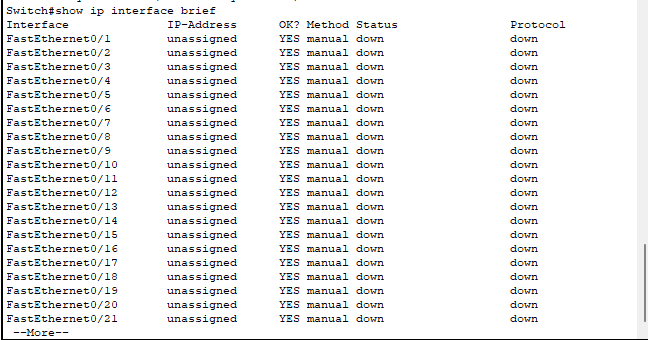

# Excercise 3

---

# GETTING TO KNOW THE CISCO-IOS INTERFACE

## OBJECTIVES

### The aim of the work is to familiarize yourself with the Cisco user interface (IOS) and the basic configuration of the switch using the Packet Tracer program.

---

#### 1. In Packet Tracer, choose the Cisco 2960 switch, select the CLI tab, and learn how the user interface works.

1. Open Packet Tracer and select Network Devices => Switches => 2960

2. Select the network switch and go to CLI tab then press Enter,

---

#### 2. Familiarize yourself with the switch interface by figuring out the meaning of the following commands. (Note that you can always type a question mark, e.g. show?, after a command, so that the command is not executed, but you can see what kind of additional commands can be entered.)

    - • Find out how to navigate the different command modes of the router (user, priviledge, global configuration and specific configuration)
    - • Try shortening commands e.g. ena instead of enable, etc.
    - • Try completing commands with the tab key

- **User mode** : User mode can be identify by the **>** symbole and when you first enter to the CLI mode you are in the user mode. You can switch between **User mode** and **Exe priviledge mode** by using commands **enable** and **disable**.

- **Exe priviledge mode** : The **Exe priviledge mode** can be identified by the **#** symbole.

- **Global configuration mode** : You can enter into this mode by command shortly **config t** or **configure terminal** command,

- **Other Commands** : You can aso use auto filling by using the tab button, It will auto fill the commands if we enter unique values, if duplicate commands are available we can always use **?** to see the available commands ex: **con ?**, **config t**

- **specific configuration modes** : You can log in to specific config modes using below commands, and exit from the modes using **exit** command or end the config mode by **end** command.
  -- line console 0
  -- line vty 0 15
  -- interface vlan 1

---

#### 3. Make sure you're in priviledge mode (use enable to access priviledge mode) and find out what the following commands mean.

- Using the show command will display the current saved details,

• show running-config : This will show the running configuration details of the switch. This is saved in the RAM and once the switch restart the setting saved under this file will be reset.

• show startup-config : This will show the startup configuration details. If you save the configuration data in startup-config file it will remain even if you restart the device. If you do not saved any startup config data it will show the message that startup-config is not present. You can copy the running config to startup-config and check if the file is updated by **copy** command. to see more simply press **spacebar**.

• show version :

• show flash

• show ip interface brief

