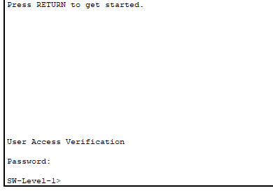
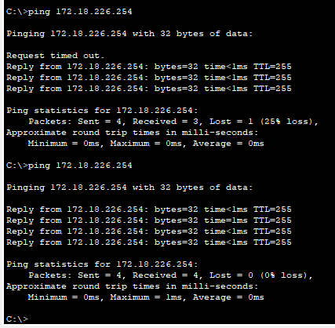

# Excercise 3

---

# GETTING TO KNOW THE CISCO-IOS INTERFACE

## OBJECTIVES

### The aim of the work is to familiarize yourself with the Cisco user interface (IOS) and the basic configuration of the switch using the Packet Tracer program.

---

#### 1. In Packet Tracer, choose the Cisco 2960 switch, select the CLI tab, and learn how the user interface works.

1. Open Packet Tracer and select Network Devices => Switches => 2960

2. Select the network switch and go to CLI tab then press Enter,

---

#### 2. Familiarize yourself with the switch interface by figuring out the meaning of the following commands. (Note that you can always type a question mark, e.g. show?, after a command, so that the command is not executed, but you can see what kind of additional commands can be entered.)

    - • Find out how to navigate the different command modes of the router (user, priviledge, global configuration and specific configuration)
    - • Try shortening commands e.g. ena instead of enable, etc.
    - • Try completing commands with the tab key

- **User mode** : User mode can be identify by the **>** symbole and when you first enter to the CLI mode you are in the user mode. You can switch between **User mode** and **Exe priviledge mode** by using commands **enable** and **disable**.

- **Exe priviledge mode** : The **Exe priviledge mode** can be identified by the **#** symbole.

- **Global configuration mode** : You can enter into this mode by command shortly **config t** or **configure terminal** command,

- **Other Commands** : You can aso use auto filling by using the tab button, It will auto fill the commands if we enter unique values, if duplicate commands are available we can always use **?** to see the available commands ex: **con ?**, **config t**

- **specific configuration modes** : You can log in to specific config modes using below commands, and exit from the modes using **exit** command or end the config mode by **end** command.
  -- line console 0
  -- line vty 0 15
  -- interface vlan 1

---

#### 3. Make sure you're in priviledge mode (use enable to access priviledge mode) and find out what the following commands mean.

- Using the show command will display the current saved details,

• show running-config : This will show the running configuration details of the switch. This is saved in the RAM and once the switch restart the setting saved under this file will be reset.

• show startup-config : This will show the startup configuration details. If you save the configuration data in startup-config file it will remain even if you restart the device. If you do not saved any startup config data it will show the message that startup-config is not present. You can copy the running config to startup-config and check if the file is updated by **copy** command. to see more simply press **spacebar**.

• show version :

• show flash

• show ip interface brief

---

#### 4. Define a suitable "host name" for your switch

---

#### 5. Define console password and privilege-mode password. Test that they work as intended.

- Setting console mode password & Testing (Password : cisco)

- Setting the privilege-mode password & Testing (Password : class)

---

#### 6. Save your settings to the "permanent memory" of the switch. Use copy running-config startup-config commands. Also command write could be use. How to find out if a configuration is saved?

- If you check the startup-configuration file **show start** it should be empty since we do not save anything. And if we check the running-configuration file by **show run** it will show the password setting and the running config data. And if we restart the device the running config data will be lost.

- Using **copy run start** will copy the running config data to starting configuration file. Then if we go **show start** it will show the saved data.

- we can confirm this using the reload command without saving anything. the system should ask for the password again even if we restart the system.

---

#### 7. Build the network as shown in the picture below

- The End Devices => PC and Network Devices => Switches => 2960 selected,

- The PC's are connected with copper straight-through cable,

- The Switches's are connected with copper cross-over cable,

---

#### 8. Assign the computer an IP address of 172.18.226.0/24 from the network. (/24 means a mask where the first 24 bits are set to one. The mask is therefore 255.255.255.0)

- The IP and the subnet can be set to the PC by click on PC => Desktop(Tab) => IP Configuration

- PC0 => IP => 172.18.226.2
- PC0 => Subnet => 255.255.2555.0 or /24 or 11111111.11111111.11111111.00000000

- PC1 => IP => 172.18.226.3
- PC1 => Subnet => 255.255.2555.0 or /24 or 11111111.11111111.11111111.00000000

---

#### 9. Test your computer-to-computer connection by pinging or using the envelope tool

**Envelop method**

- Select the closed envelop and click on PC0 and PC1, then the msg should flow, the success msg should be visible as below,

- To see the simulation you can select on Simulation and play to see the dataflow,

**pinging mode**

- Go to PC0 => Desktop => Command Prompt, Then use command ping 172.18.226.2 & ping 172.18.226.3, If you see the below msg then connection is success.

- You can repeat this on PC1, if you need to double check,

---

#### 10. Assign each switch its own IP address from that previously used network. As you saw earlier, the switch forwards computer-to-computer traffic even if it doesn't have an IP address. The importance of the IP address on the switch is only related to network management.

- Click on the switch and open the CLI

- 1. Update the Hostname of the switch to SW-Room-1.

- 2. Assign IP address 172.18.226.253 and subnetmask 255.255.255.0 to SW-Room-1. Turn on the IP port by **no shutdown** command.

- I had to change the IP again since I have set an incorrect IP as per the image, so the following step is an additional step.

- 3. Save the running config to startup config by **copy run start**

- 4. Repeat this to Switch 2 with following data,

| ----------- | --------- | -------------- | ------------- |
| Device Name | Host Name | IP | Subnet Mask |
| ----------- | --------- | -------------- | ------------- |
| PC 0 | - | 172.18.226.2 | 255.255.255.0 |
| PC 1 | - | 172.18.226.3 | 255.255.255.0 |
| SW1 | SW-Room-1 | 172.18.226.253 | 255.255.255.0 |
| SW2 | SW-Room-2 | 172.18.226.254 | 255.255.255.0 |
| ----------- | --------- | -------------- | ------------- |

---

#### 11. Test the operation by pinging from computer to switches and from switches to switches, etc.

- Using PC0 => Desktop => Command Prompt, pinging from computer to computer

- Using pinging from PC0 to SW1

- Using pinging from PC0 to SW2

---

#### 12. Enable telnet management of switches by specifying telnet passwords
