# Exercise 6

#### The goal of the exercise is to get familiar with the operation of the ARP protocol, the use of mac addresses, as well as the MAC address table of the switch. RETURN to Moodle your answers to the questions presented, as well as the PC's ARP and switch MAC address table.

1. Find out your computer's MAC address

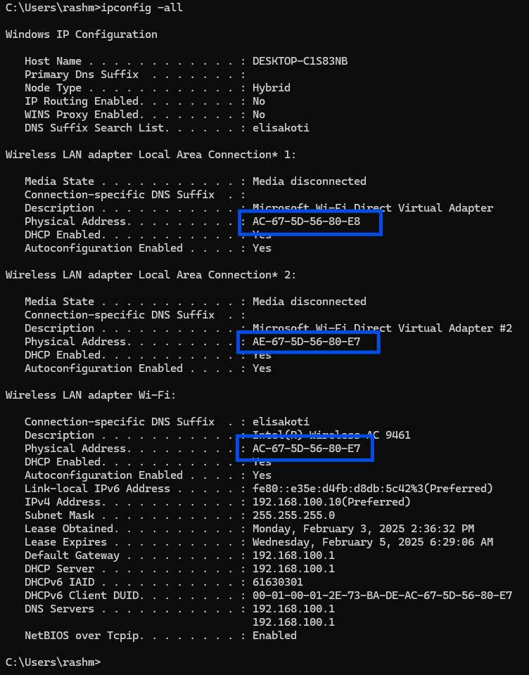

- MAC address related to WI-FI : AC-67-5D-56-80-E7

2. Check out your computer's ARP table (arp-a)

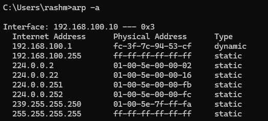

3. Find out what the gateway address of your computer is

- Default Gateway . . . . . . . . . : 192.168.100.1

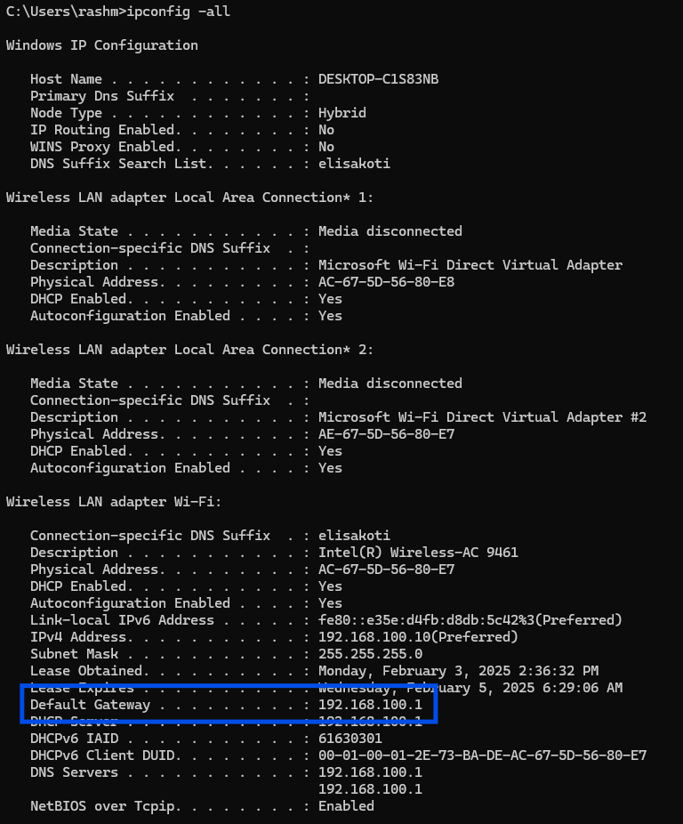

4. Open the Packet Tracer program and build the network shown in the illustration.

- Connect computers to ports F0/1 and connect switches to each other from ports F0/24.
- You can use the 2960 series switches.

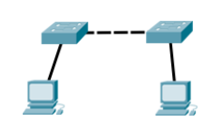

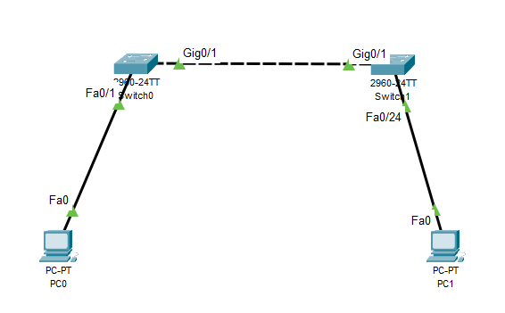

5. Name the switches S1 and S2

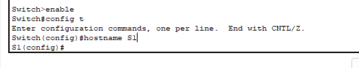

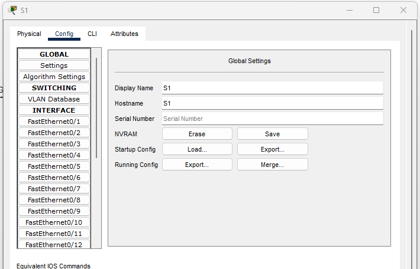

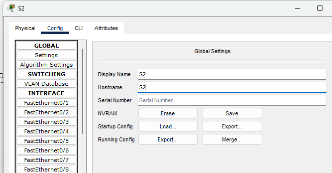

6. Assign IP addresses to computers. Use the 192.168.6.0 /24 network

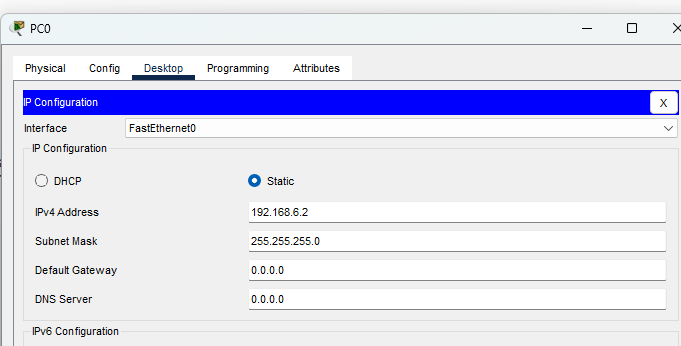

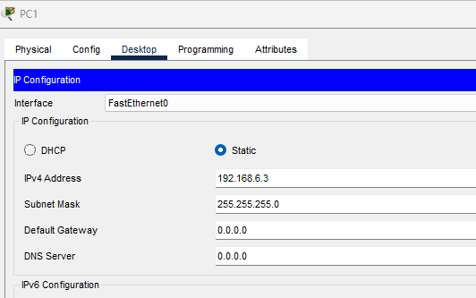

7. Check out the ARP table on both computers. What addresses appear on the table?

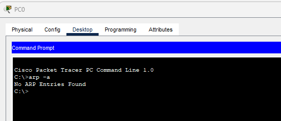

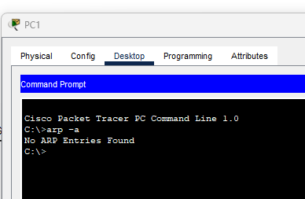

8. Ping to test the connection between computers and check the ARP table again. Has
   anything changed?

   Then the ARP table shows the data.

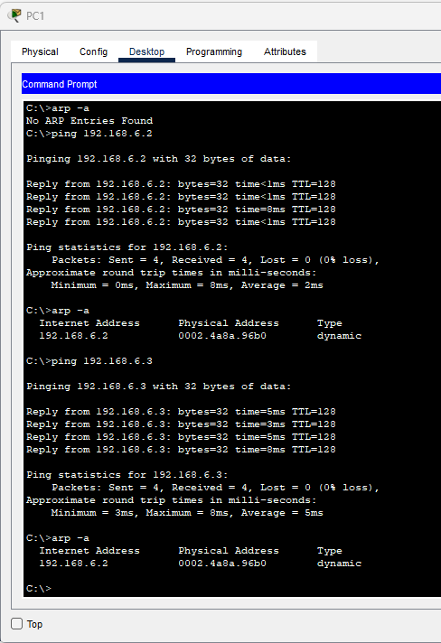

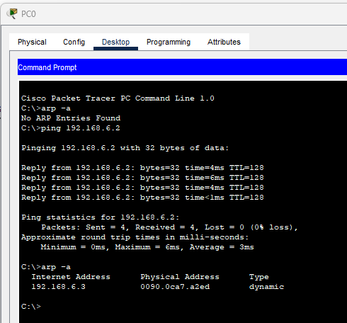

9. Find out what the switch arp table looks like (Switch#show arp )

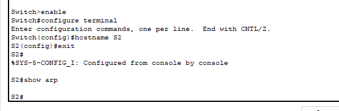

The ARP table is empty in the Switch

- • What you should to do that it's possible to see arp-table on the switch?

- - Set an IP address to the switch and enable it.

- • Why arp table of the switch is empty?

- - Because the Switch do not have a IP address
- - The switch may be operating as a Layer 2 device without its own IP interface.
- - No IP traffic (and thus no ARP requests/replies) has been generated by the switch.

10. Check the contents of the switch's mac address table

- • If mac address table is empty, you should ping between computers again

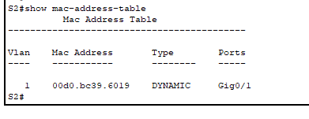

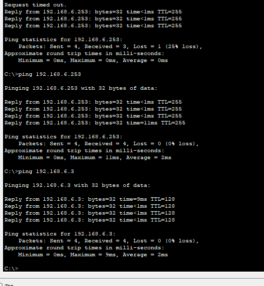

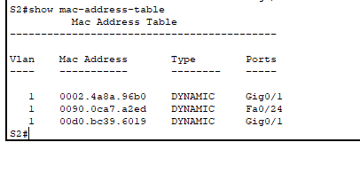

11. What's the difference between arp and mac address tables?

#### RETURN to the Moodle: Answers to the questions asked and PC’s arp table and switch mac address table. All in same file
