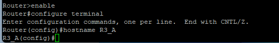

# LAB EXERCISE

Familiarization with routing and router settings

The exercise is done in groups of two, using classroom computers and routers.

In this exercise needed two computer and one router

1. Login to the class computer (password = tllabra)

2. Establish a management connection to the router from computer (from just one computer)
   • Use Router R3, so connect the console connection from computer (PC CON, on the desk) to the console port on the router (R3-con, in the cabinet).

   

3. Open the connection to the router using Putty-software
   • If Router ask: “Would you like to enter the initial configuration dialog? [yes/no]:” ANSWER, no
   • If Router ask: “Would you like to enter basic management setup? [yes/no]: ANSWER, no

4. Configure a host name for a router. Use the same name as on the device label in the cabinet.

5. Configure IP addresses for the router's interfaces as presented in the lecture material. Use both 192.168.10.0/24 and 192.168.20.0/24 network.
   • Once the IP addresses have been assigned, use the show ip interface brief command on the router to
   check whether the IP addresses and masks are correct.

6. Build a network with two computers and one router, as shown in the figure below

7. Assign IP configurations to computers (TP-Link network card ) Make sure that the IP address of the router
   interface is on the same network as the computer connected to it. And remember configuring a default gateway.

8. Test connections by pinging. Try to ping first from computer to router and after that from computer to another
   computer. If all steps have been done correctly, the connections should work properly.

9. When all connections are working, check the router's routing table (show ip route), save it to a text file and return it to Moodle.

10. Disconnect all cables what you are use from patch cabinet

[show ip route](https://github.com/Rashmika-Dineth/Information-Networks/blob/main/Task%207/IP%20DATA.txt)
